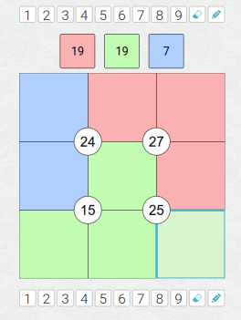

# Brute-force Suko Puzzle Solver
Solves suko puzzles from puzzle parameters (clues) entered on the command line.
## About Suko Puzzles
Suko puzzles have nine boxes arranged in a 3 by 3 grid.  Players fill in the grid with the digits 1 through 9.  Placement of the digits must satisfy the puzzle's clues:
* Circle Clues - four circles on the grid contain the sums of their surrounding boxes
  * Top-left circle holds sum of top-left four boxes (1, 2, 4, and 5)
  * Top-right circle holds sum of top-right four boxes (2, 3, 5, and 6)
  * Bottom-left circle holds sum of bottom-left four boxes (4, 5, 6, and 7)
  * Bottom-right circle holds sum of bottom-right four boxes (5, 6, 8, and 9)
* Color Clues - Sets of boxes are associated with a color.  The same-colored boxes sum to the color's value.
  * First color holds the sums of four boxes.
  * Second color holds the sum three boxes.
  * Third color holds the sum of two boxes.

Sample puzzle and its solution:

Blank Puzzle | Solved Puzzle
-------------|-------------
|

*Sample puzzle from [Puzzle Madness's Daily Suko Puzzle](https://puzzlemadness.co.uk/suko/mixed/2021/1/18).*

## Usage
On the command line, enter the `suko` command followed by the puzzle clues in the following order:
> `$ suko  -s tl,tr,bl,br -a asum,a1,a2,a3,a4 -b bsum,b1,b2,b3 -c csum,c1,c2'

That is, enter the four circle sums, then the three sets of color sums with each color sum's box numbers 
trailing it.  From the above puzzle (argument spacing added for clarity):
```
$ suko -s 24,27,15,25 -a 19,5,7,8,9 -b 19,2,3,6 -c 7,1,4
5 9 3
2 8 7
1 4 6
$
```
Accepted flags are
  - `-l`  print answer in a single line, suitable for consumption in a pipelined command stream
  - `-g`  print answer in a 3x3 grid (default)
  - `-M`  print all grids (matrices) that match the -s clues, ignore the color clues
  - `-v`  show all input parameters before solving puzzle
  - `-h`  display help information and exit

Example:
```
$ suko -l -s 24,27,15,25 -a 19,5,7,8,9 -b 19,2,3,6 -c 7,1,4
5 9 3 2 8 7 1 4 6
$
```
Program returns success (0 on UNIX/Linux) if it solves the puzzle, failure otherwise.


## Method
The program operates by brute force.  A suko grid's nine numbers have 
exactly factorial 9 (9!) combinations or 362,880 grid patterns.
That is not a large dataset or number of possible answers for any
computer to handle.

The program contains all possible permutations in file `grids.h`.  The program
`makegrids` permutes the digit list `1,2,3,4,5,6,7,8,9` to make this file.  The
permutations are compiled into the `suko` program.

The program reads the clues from the command line arguments then checks 
every grid permutation for one that satisfies the parameters, prints it,
then exits. If `suko` finds no suitable grid it exits with an error.

Program runs in *O(n)* time on failure (must look at every grid) and finds a
suko solution in average *O(n/2)* time.  On a 2014-era laptop, these times are
about 0.012s and 0.006s, respectively.

Before seaching the set of grids the program performs simple sanity checks.
 
## Implementation
 Source language: **C**
 
 Build environment: **Debian / Ubuntu Linux**
 
 Build tools: default **C** compiler, `gcc`; Gnu `make`
 
 Execution environment: standard shell, `bash`
 
 Note: 
   * The program's executable is large (~3MB) as it stores all 362,880 grids as 1-byte signed integers (9-byte arrays).
 It could be far smaller if it permuted the grids during runtime, but that seems less brutal.
 
## Building the Program
Download all files into a directory and issue the `make` command:
```
$ make
cc -c main.c -g
cc -c parameters.c -g
cc -o suko main.o parameters.o -g
$
```
If desired, install the resulting `suko` program in a local or system `bin` 
or other location in the executables path.

Running the `makegrids` program is unecessary unless `grids.h` is missing.
The program emits the `.h` file on standard out:
```
$ makegrids > grids.h
```
or
```
$ make grids.h
cc -o makegrids makegrids.c -g
./makegrids > grids.h
$
```
___
